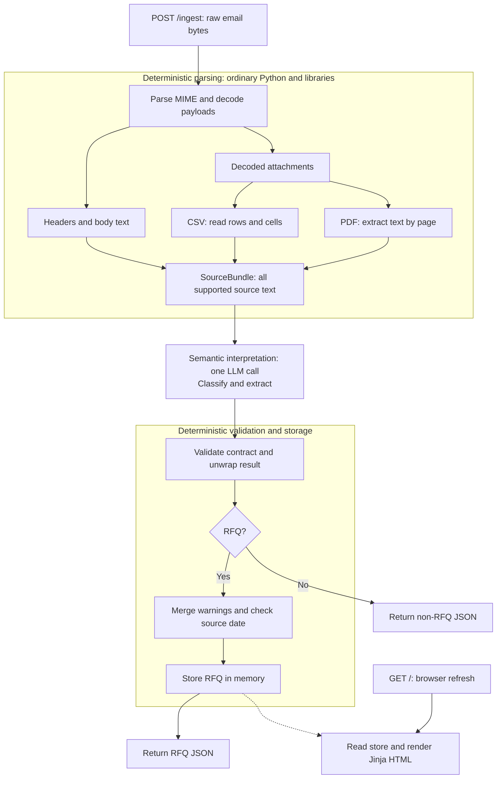

# RFQ ingestion architecture

Build one Python application that reads an email, extracts its supported contents, uses one LLM request to classify and extract, and displays accepted RFQs in a dashboard.

**Requirement source:** [SPEC.md — The core task](SPEC.md#the-core-task-required) and [The output contract](SPEC.md#the-output-contract). These documents describe the intended implementation, not completed software.

## Scope

Implement raw `.eml` ingestion, body/CSV/text-PDF parsing, RFQ classification and extraction, the exact `POST /ingest` response, a minimal dashboard, and a README. Preserve uncertainty using the contract's existing notes and warnings.

Vision, OCR, optional enrichment/verification features, and the user's separate feature addition are outside this baseline. Do not scaffold them. Authentication, deployment, real ERP integration, Excel, and multi-user functionality are excluded by [Constraints and non-goals](SPEC.md#constraints-and-non-goals).

## System flow



Parsing reveals source content; the model interprets its business meaning. Validation checks structure, not factual correctness. Processing failures return an HTTP error, not a negative classification.

## Stack and repository skeleton

Use Python 3.10, FastAPI, Pydantic, standard-library `email`/`csv`, `pypdf`, the official OpenAI SDK, and Jinja2. Use a small HTML-to-text conversion for HTML-only bodies and `pytest` for tests. Alternatives are explained in [DECISIONS.md](DECISIONS.md).

Proposed repository layout; application files are created during implementation. Code and sample paths are relative to the repository root; documentation links are relative to `architecture/`.

```text
rfq-ingestion/
├── app/
│   ├── __init__.py
│   ├── main.py                 # App setup, HTTP routes, error responses
│   ├── models.py               # Parsed input, SourceBundle, public result models
│   ├── email_parser.py         # MIME, headers, body, decoded attachment bytes
│   ├── attachment_parser.py    # CSV/PDF text and source-bundle assembly
│   ├── llm_client.py           # Prompt, one provider call, response validation
│   ├── rfq_service.py          # Parsing → extraction → warnings → storage
│   ├── store.py                # In-memory RFQ collection
│   └── templates/
│       └── index.html          # Read-only dashboard
├── tests/
│   ├── test_parsing.py         # Email/CSV/PDF parsing and source completeness
│   ├── test_contract.py        # Exact schemas, required keys, invalid values
│   ├── test_ingest.py          # API, failures, storage, dashboard; fake extractor
│   └── test_live_samples.py    # Opt-in checks using the real model
├── samples/
│   ├── *.eml                  # Original supplied emails, unchanged
│   ├── labels.json            # Reference answers for tests only
│   └── parts-catalog.csv       # Supplied optional material; unused by this baseline
├── spec.pdf                   # Authoritative original assignment
├── architecture/
│   ├── SPEC.md                # Faithful, searchable assignment transcription
│   ├── ARCHITECTURE.md        # System design and this repository skeleton
│   ├── DATA_FLOW.md           # Parsing and sample behavior
│   ├── LLM_DESIGN.md          # Output contract and model boundary
│   ├── DECISIONS.md           # Tradeoffs and accepted limitations
│   ├── IMPLEMENTATION_PLAN.md # Build order and completion checks
│   └── AGENTS.md              # Shared coding guidance
├── README.md                  # Setup, usage, decisions, tests, limitations
├── pyproject.toml             # Dependencies and test configuration
├── .env.example               # OPENAI_API_KEY / OPENAI_MODEL placeholders
└── .gitignore                 # Secrets, local environment, generated caches
```

The service calls the parsers, extractor, and store; `main.py` handles HTTP. Keep these as small modules rather than interface hierarchies. Make the extractor replaceable with a fake callable in tests.

## Data passed between components

- **ParsedEmail:** sender, subject, source date, body text, decoded attachments, parser warnings.
- **SourceBundle:** the headers plus named text chunks for the body, CSV rows, and PDF pages. No binary payloads reach the model.
- **Stored RFQ:** validated public result plus subject and ingestion time for display. This metadata never enters the public response.

Keep raw bytes and source text request-local. The service merges parser/model warnings and flags a due date earlier than the email date without changing it.

## HTTP and dashboard

`POST /ingest` accepts raw bytes as `message/rfc822` or `application/octet-stream`; it returns the exact success shape in [LLM_DESIGN.md](LLM_DESIGN.md). It does not accept a server-side filename.

`GET /` renders stored RFQs with customer/request fields, line items, confidence, and warnings. Use one template, an empty state, and expandable details. Escape all displayed text; preserve the distinction between zero and missing values.

Use one application-owned store and one worker. Restart clears results; re-ingestion adds another entry. Keep blocking parsing/SDK work off the event loop using a worker-thread call to the synchronous service. No background-job system is needed.

## Where to look next

[DATA_FLOW.md](DATA_FLOW.md) owns parsing and sample policies. [LLM_DESIGN.md](LLM_DESIGN.md) owns the output contract and model boundary. [IMPLEMENTATION_PLAN.md](IMPLEMENTATION_PLAN.md) gives the build order. [SPEC.md](SPEC.md) contains the assignment requirements.
