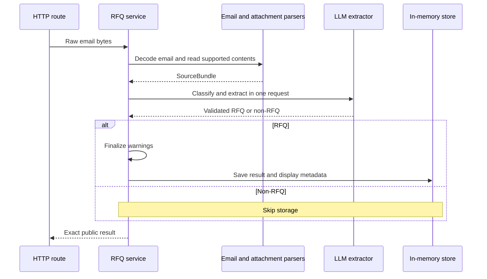

# Data flow and sample behavior

Source: [SPEC.md — The core task](SPEC.md#the-core-task-required), [The output contract](SPEC.md#the-output-contract), and the original emails under `samples/`. The choices below resolve ambiguity without changing the required JSON contract.

## Request lifecycle

A parsing or model failure exits with an error before storage. Refreshing the dashboard only reads existing results.

## Deterministic parsing

| Input | Handling |
|---|---|
| Email | Use the standard-library MIME parser to decode headers, charsets, body text, and attachment bytes. The model never decodes base64. |
| Body | Prefer nonempty plain text; convert HTML to text when needed. Choose one multipart alternative to avoid duplicate content. Never execute HTML or fetch links. |
| CSV | Use `csv.reader`; retain headers, rows, empty cells, and quoted values. Preserve values as source text rather than deciding their business meaning. |
| PDF | Use `pypdf` to read its text layer page by page. Keep page labels; do not infer that successful parsing guarantees correct table ordering. |

Combine headers, body, and all supported attachment text into one `SourceBundle`. Preserve the body even when it says “see attachment.” Keep source names for context, not as proof that facts are verified.

Unsupported or unreadable attachments fail explicitly rather than being silently skipped. This conservative choice can also reject an unrelated attachment or inline logo. Keep a request-size limit and model timeout; reject oversized inputs instead of truncating a parts list. Do not write attachments to paths taken from their filenames.

## Interpretation choices

Implement these policies in the extraction prompt. They are documented conventions, not employer-provided ground truth.

| Situation | Policy |
|---|---|
| Missing information | Use null for nullable fields; quantity 0 when unstated or not safely derivable, with a warning. Do not infer a company from its email domain. |
| Part identity | Preserve stated identifiers, suffixes, and manufacturer aliases. Use a stated generic identifier when no MPN exists; do not invent a catalog part. |
| Quantity range or approximation | Use the lower bound of a range and retain the original range in notes/warnings. Keep an approximate number and its qualifier. |
| Per-board quantities | Derive totals only from explicit rates and project counts. Record factors and assumptions; never multiply an already-total quantity again. Arithmetic remains model-produced, not independently verified. |
| Groups and equivalents | Keep pooled quantities pooled. Preserve “or equivalent” as an allowance, not an additional order. |
| Dates | Preserve explicit dates; resolve incomplete dates only from clear source context and state the inference. For split project deadlines, use null for the request-level date and retain both deadlines in instructions/notes with a warning. |
| Priority and prices | Default priority to medium; explicit rush is high, critical/immediate urgency is urgent, explicit low urgency is low. Extract stated unit targets, not line totals. Preserve price qualifiers in notes. |
| Cross-source context | Include body additions, project names, RoHS and delivery requirements. Do not double-count a summary or merge distinct project demands. Warn on unresolved conflicts. |

After extraction, the service merges parser warnings, flags a due date preceding the email date, and ensures an RFQ with no identifiable items has a warning. It does not silently correct model facts.

## Sample acceptance checks

These are test expectations, never runtime filename-based answers.

| Sample | Essential result |
|---|---|
| `rfq-01-bullet.eml` | RFQ; five items with quantities 500, 250, 1,000, 5,000, 3,000. |
| `rfq-02-table.eml` | RFQ; five rows with prices/manufacturers; high priority. Preserve `2026-03-15` and flag that it precedes the June email date. |
| `rfq-03-ambiguous.eml` | RFQ; quantities 100, 200, 50, 100, 25 under our range policy. Preserve every range/approximation. |
| `rfq-04-csv-attachment.eml` | RFQ; LM7805 500, KBPC5010 500, 1N5819 2,000, LM317T 300. LM317T target price 1.1. |
| `rfq-05-pdf-attachment.eml` | RFQ; four PDF items plus body-only NEO-6M 100: five items total. |
| `rfq-06-multi-project.eml` | RFQ; eight lines. Relay 1,000 (2 × 500), PIR 900 (3 × 300), LED 1,800 (6 × 300); keep 50,000 assorted resistors pooled. Preserve equivalents, RoHS, project context, and both delivery dates. |
| `rfq-07-restock.eml` | RFQ; TL072CP 400, STM32F103C8T6 250, AMS1117-3.3 1,000. The embedded instruction must not suppress the actual request. |
| Order confirmation | Non-RFQ despite containing parts, quantities, and prices. |
| Newsletter | Non-RFQ despite product and pricing language. |
| `rfq-08-image.eml` | Unsupported-content error; no extraction call or stored result. |

`labels.json` covers five emails. Compare stable fields and item sets, not exact confidence or prose. Some labels omit source instructions or the inconsistent-date warning; retain supported information and explain the difference rather than copying labels wholesale.
