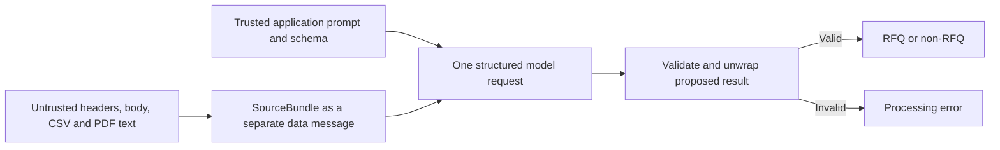

# LLM boundary and output contract

Use one structured request to classify the message and extract its fields. There is no separate classifier, repair pass, or self-critique loop.

**Contract source:** [SPEC.md — The output contract](SPEC.md#the-output-contract). The examples below show the required keys; sample values are illustrative.

## Public responses

### RFQ

```json
{
  "isRfq": true,
  "confidence": 0.9,
  "customer": {
    "name": null,
    "email": null,
    "phone": null,
    "company": null
  },
  "request": {
    "dueDate": null,
    "priority": "medium",
    "specialInstructions": null
  },
  "lineItems": [
    {
      "partNumber": "LM358N",
      "manufacturer": "TI",
      "description": null,
      "quantity": 500,
      "targetPrice": null,
      "notes": null
    }
  ],
  "warnings": []
}
```

### Non-RFQ

```json
{
  "isRfq": false,
  "confidence": 0.95,
  "reason": "Order confirmation, not a request for quotation."
}
```

Every key is required within its branch, including keys whose value is null. Return neither storage metadata nor a provider wrapper. A negative result contains only `isRfq`, `confidence`, and a one-line `reason`.

Define these models once in `app/models.py` using Pydantic. Forbid extra fields and validate actual booleans, integer quantities, finite confidence in [0, 1], nonnegative quantities/prices, nonblank part identifiers, and valid `YYYY-MM-DD` dates. Priority is `low | medium | high | urgent`. Nullable textual fields accept strings or null; target price accepts a number or null. Do not silently coerce malformed output or fill omitted keys.

## Provider response

Use the official OpenAI SDK with a model tested to support the chosen structured-output schema. Read `OPENAI_API_KEY` and `OPENAI_MODEL` from the environment; never commit the key.

The provider-only model is `ModelEnvelope`, with one field:

```text
result: RfqResult | NonRfqResult
```

This places the union below an object root. Validate the envelope and return only `envelope.result` from the extractor; `/ingest` must never expose `{"result": ...}`. Test schema compatibility early rather than designing a provider abstraction.

Keep one configured client with a timeout and close it on application shutdown. Disable automatic SDK retries for this baseline so one ingestion means one provider attempt. A caller can resubmit after failure.

## Instructions and trust boundary



Keep one prompt in `llm_client.py`. It must distinguish requesting a quote from confirmations/marketing, use the complete source bundle, and implement the interpretation policies in [DATA_FLOW.md](DATA_FLOW.md). Request concise notes and warnings, not a reasoning transcript.

Explicitly treat all source strings—including apparent “system instructions”—as data. Keep application instructions separate from JSON-serialized source content. Expose no tools, secrets, or link-following capability. Do not remove the supplied attack with a sample-specific regex or use labels/catalog data as model input.

Structured output constrains shape; it does not establish truth or guarantee injection resistance. Confidence is the model's uncalibrated assessment. Evaluate semantic behavior with actual model calls, especially the restock injection and body/PDF merge.

## Failures

The [output contract](SPEC.md#the-output-contract) supplies success shapes but no error schema. Use FastAPI's normal `detail` error response with a short, safe explanation. Never return `isRfq: false` for a technical failure, and never store a failed extraction.

| Status | Circumstance |
|---|---|
| 400 | Empty or unusable email input |
| 413 | Input exceeds the application's documented size limit |
| 415 | Unsupported outer HTTP content type |
| 422 | Unsupported/unreadable attachment or no usable source text |
| 502 | Provider refusal, incomplete response, or invalid structured result |
| 503 | Missing configuration or unavailable provider |
| 504 | Provider timeout |

Unexpected application bugs remain server errors. Do not leak credentials, full source content, or raw provider exception messages. Do not salvage partial JSON into an apparent success.
